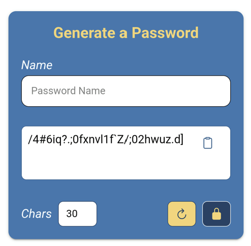
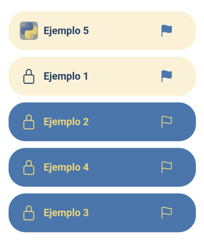
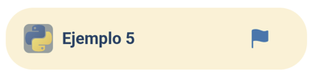
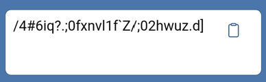
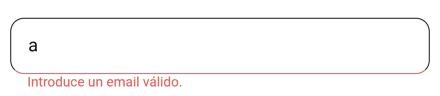
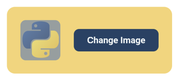
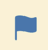

# Componentes

Con el fin de construir una aplicación modular, se han abstraído de las páginas una serie de componentes reutilizables. A continuación, se detallan los componentes implementados.

| NOMBRE                                                                                                   | PÁGINA DONDE APARECE                                                                                                                                                                                                                                                                                                                                  | DESCRIPCIÓN                                                                                                                                                                                                                                 | IMAGEN                                                   |                                                                                                                                                                                      
|----------------------------------------------------------------------------------------------------------|-------------------------------------------------------------------------------------------------------------------------------------------------------------------------------------------------------------------------------------------------------------------------------------------------------------------------------------------------------|---------------------------------------------------------------------------------------------------------------------------------------------------------------------------------------------------------------------------------------------|----------------------------------------------------------|
| [`HeaderComponent`](../src/app/components/header/header.component.ts)                                    | [`HomePage`](../src/app/home/home.page.ts), [`LoginPage`](../src/app/pages/login/login.page.ts), [`RegisterPage`](../src/app/pages/register/register.page.ts), [`ListPage`](../src/app/pages/list/list.page.ts), [`PasswordDetailPage`](../src/app/pages/password-detail/password-detail.page.ts)                                                     | Barra de navegación superior. Permite navegar a las distintas páginas de la aplicación.                                                                                                                                                     |                          |
| [`PasswordCardComponent`](../src/app/components/password-card/password-card.component.ts)                | [`HomePage`](../src/app/home/home.page.ts)                                                                                                                                                                                                                                                                                                            | Componente de generación de contraseñas. Permite al usuario introducir un nombre, ajustar la longitud, generar una contraseña aleatoria y guardarla en Firestore. Si el usuario no está autenticado, redirige al login al intentar guardar. |            |
| [`PasswordListComponent`](../src/app/components/password-list/password-list.component.ts)                | [`ListPage`](../src/app/pages/list/list.page.ts)                                                                                                                                                                                                                                                                                                      | Lista todas las contraseñas guardadas del usuario autenticado. En dispositivos móviles, fija las contraseñas destacadas.                                                                                                                    |            |
| [`PasswordPreviewComponent`](../src/app/components/password-preview/password-preview.component.ts)       | [`ListPage`](../src/app/pages/list/list.page.ts) (dentro de [`PasswordListComponent`](../src/app/components/password-list/password-list.component.ts))                                                                                                                                                                                                | Vista previa de una contraseña. Muestra el nombre, la imagen y, en móvil, muestra el icono de pin para fijar/desfijar la contraseña. Navega a la página de detalle al hacer clic.                                                           |      |
| [`GeneratorControlsComponent`](../src/app/components/generator-controls/generator-controls.component.ts) | [`HomePage`](../src/app/home/home.page.ts) (dentro de [`PasswordCardComponent`](../src/app/components/password-card/password-card.component.ts)), [`PasswordDetailPage`](../src/app/pages/password-detail/password-detail.page.ts)                                                                                                                    | Panel de control para ajustar la longitud de la contraseña, volver a generarla y guardarla. Emite eventos al componente padre para que ejecute las acciones correspondientes.                                                               |  |
| [`CopyTextareaComponent`](../src/app/components/copy-textarea/copy-textarea.component.ts)                | [`HomePage`](../src/app/home/home.page.ts) (dentro de [`PasswordCardComponent`](../src/app/components/password-card/password-card.component.ts)), [`PasswordDetailPage`](../src/app/pages/password-detail/password-detail.page.ts)                                                                                                                    | Área de texto de solo lectura que muestra el valor de la contraseña. Incluye un botón para copiar el contenido al portapapeles.                                                                                                             |            |
| [`CustomInputComponent`](../src/app/components/custom-input/custom-input.component.ts)                   | [`HomePage`](../src/app/home/home.page.ts) (dentro de [`PasswordCardComponent`](../src/app/components/password-card/password-card.component.ts)), [`LoginPage`](../src/app/pages/login/login.page.ts), [`RegisterPage`](../src/app/pages/register/register.page.ts), [`PasswordDetailPage`](../src/app/pages/password-detail/password-detail.page.ts) | Campo de formulario reutilizable que encapsula un `ion-input` y acepta un `AbstractControl` externo, tipo (`text`, `email`, `password`) y _placeholder_, facilitando la validación reactiva.                                                |              |
| [`ImageUploadComponent`](../src/app/components/image-upload/image-upload.component.ts)                   | [`PasswordDetailPage`](../src/app/pages/password-detail/password-detail.page.ts)                                                                                                                                                                                                                                                                      | Selector de imagen que permite subir un icono personalizado para la contraseña. Delega la subida al servicio `CloudinaryService`..                                                                                                          |              |
| [`PasswordPinComponent`](../src/app/components/password-pin/password-pin.component.ts)                   | [`ListPage`](../src/app/pages/list/list.page.ts) (dentro de [`PasswordPreviewComponent`](../src/app/components/password-preview/password-preview.component.ts)), [`PasswordDetailPage`](../src/app/pages/password-detail/password-detail.page.ts)                                                                                                     | Icono de bandera que representa el estado de pin de una contraseña. Solo se muestra en plataformas nativas (móvil). Emite un evento `togglePin` al ser pulsado y cambia de color según el estado.                                           |              |
