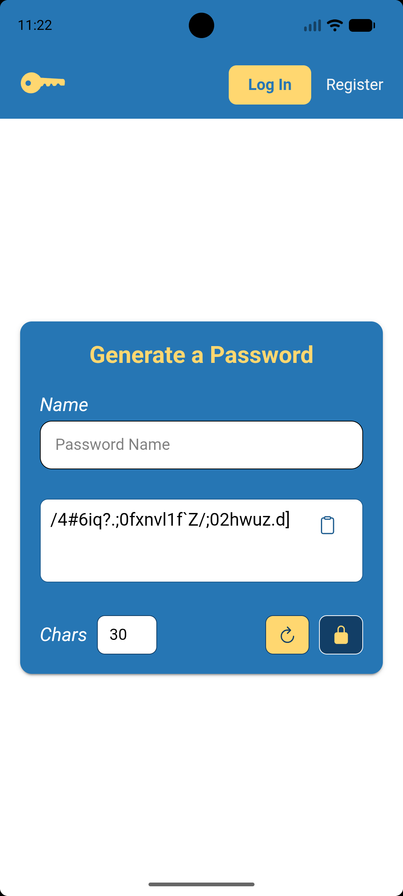
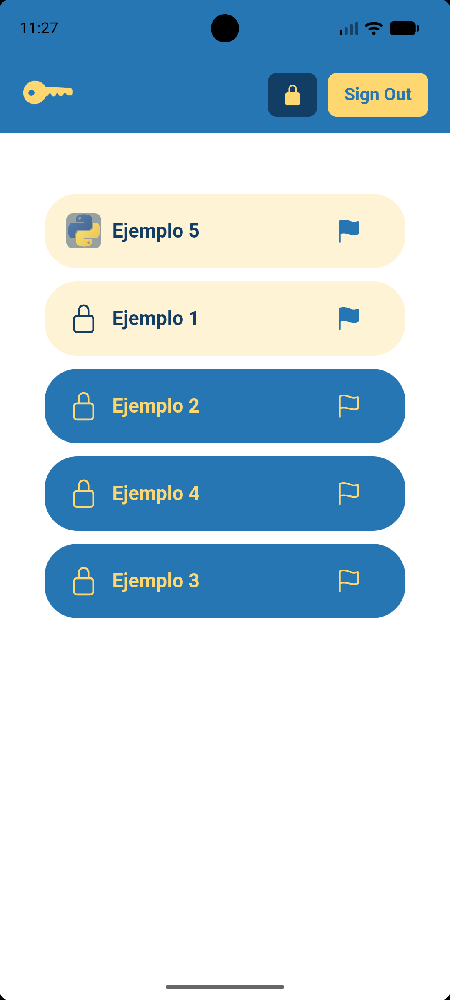
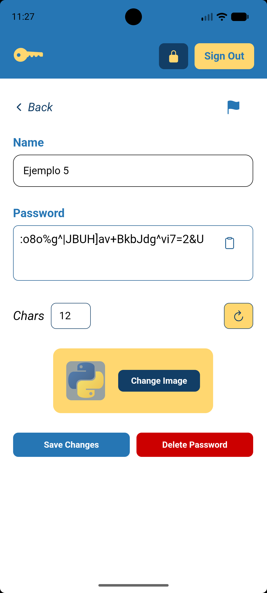

# Páginas

A continuación, se muestran todas las páginas (componentes _rutables_) de la aplicación.

| NOMBRE                                                                           | RUTA                                | DESCRIPCIÓN                                                                                                                                                                              | IMAGEN                          |
|----------------------------------------------------------------------------------|-------------------------------------|------------------------------------------------------------------------------------------------------------------------------------------------------------------------------------------|---------------------------------|
| [`HomePage`](../src/app/home/home.page.ts)                                       | `/home` (Pública)                   | Página principal de la aplicación. Muestra el generador de contraseñas ([`PasswordCardComponent`](../src/app/components/password-card/password-card.component.ts)) centrado en pantalla. |          |
| [`LoginPage`](../src/app/pages/login/login.page.ts)                              | `/login` (Usuario no registrado)    | Formulario de inicio de sesión. Permite autenticarse con email y contraseña o mediante Google.                                                                                           |        |
| [`RegisterPage`](../src/app/pages/register/register.page.ts)                     | `/register` (Usuario no registrado) | Formulario de registro de nuevos usuarios. Recoge nombre, apellido, teléfono, email, contraseña y foto de perfil opcional. También permite el registro con Google.                       |  |
| [`ListPage`](../src/app/pages/list/list.page.ts)                                 | `/list` (Usuario registrado)        | Página de contraseñas guardadas. Muestra el listado de las contraseñas guardadas de un usuario, fijando las contraseñas destacadas (**móvil**).                                          |          |
| [`PasswordDetailPage`](../src/app/pages/password-detail/password-detail.page.ts) | `/detail/:id` (Usuario registrado)  | Vista de detalle de una contraseña concreta. Permite editar el nombre, regenerar la contraseña, subir un icono, fijar/desfijar (**móvil**) y eliminar la entrada.                        |      |
