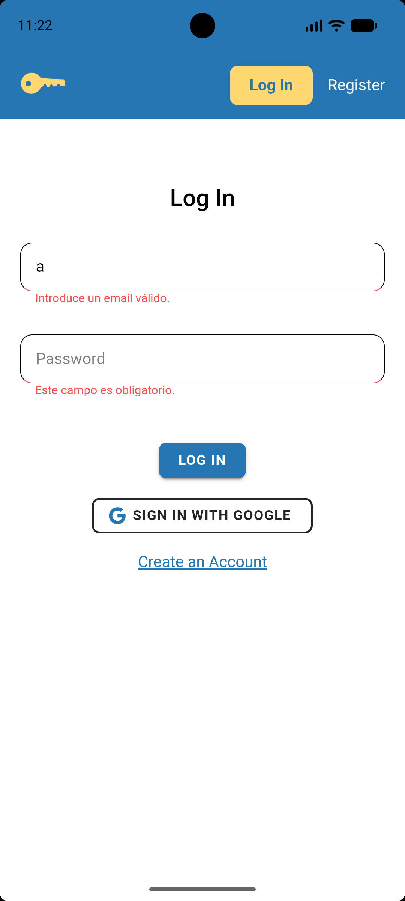
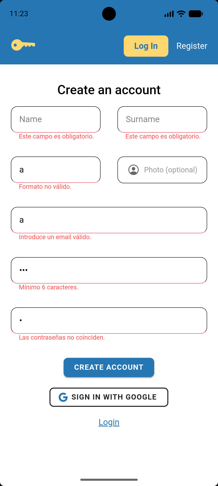

# Lock It - Gestor de Contraseñas

**Lock It** es una aplicación móvil y web que permite a los usuarios generar contraseñas seguras y almacenarlas en la nube.

> [!IMPORTANT] 
> ### Características Principales
>
> * **Generador de Contraseñas Inteligente:** 
>  * Generación de cadenas seguras con longitud personalizable
> * **Almacenamiento en la Nube:**
>  * Almacenamiento en tiempo real utilizando _Firestore_.
> * **Gestión local de favoritos:**
>  * En dispositivos móviles, destacar contraseñas localmente, en la base de datos SQLite.
---

## Arquitectura

Este proyecto se ha estructurado siguiendo las buenas prácticas de Ionic. 
El backend y el frontend están desacoplados, gracias al uso de servicios en la interacción con el backend y los datos. 
Además, gracias al uso de componentes, se obtiene una alta modularidad en el código.
Esta ha sido la estructura utilizada:

```bash
src/
└── app/
    ├── components/             # Componentes que se utilizarán para el desarrollo de las páginas
    │   └── ...
    ├── guards/                 # Guardias de autenticación para asegurar el correcto acceso a las páginas
    ├── home/                   # Pantalla de inicio pública con el generador de contraseñas
    ├── models/                 # Tipado estricto y abstracción de datos
    │   └── ...
    ├── pages/                  # Páginas de la aplicación
    │   └── ...
    ├── services/               # Lógica de servicios externos
    │   └── ...
    ├── app.component.html      # Componente (enrutador) principal de la aplicación 
    ├── app.module.ts           # Raíz de la aplicación
    └── app-routing.module.ts   # Declaración de todas las rutas de navegación
```

> [!NOTE]
> Para más información acerca de la aplicación, consulte la documentación de [`páginas`](./doc/pages.md), [`componentes`](./doc/components.md) y [`servicios`](./doc/services.md).

---

## Validación de formularios

Los formularios de la aplicación utilizan **Formularios Reactivos de Angular** (`ReactiveFormsModule`). La validación se realiza en el cliente antes de enviar ningún dato al servidor.

| FORMULARIO | VALIDACIONES | IMAGEN |
|---|---|---|
| [`LoginPage`](src/app/pages/login/login.page.ts) | **Email:** requerido, formato email válido. <br> **Contraseña:** requerida. |  |
| [`RegisterPage`](src/app/pages/register/register.page.ts) | **Nombre y apellido:** requeridos. <br> **Teléfono:** requerido, 9 dígitos numéricos. <br> **Email:** requerido, formato email válido. <br> **Contraseña:** requerida, mínimo 6 caracteres. <br> **Confirmar contraseña:** debe coincidir con la contraseña. |  |

---

## Tech Stack - Otros

- Se debe usar `npm install` para instalar las dependencias de la aplicación.

<br>
<div style="display: flex; justify-content: center">
    <div style="display: inline-block; padding: 10px; border-radius: 20px; ">
      
      
      
      
      
      
   </div>
</div>
<br>
